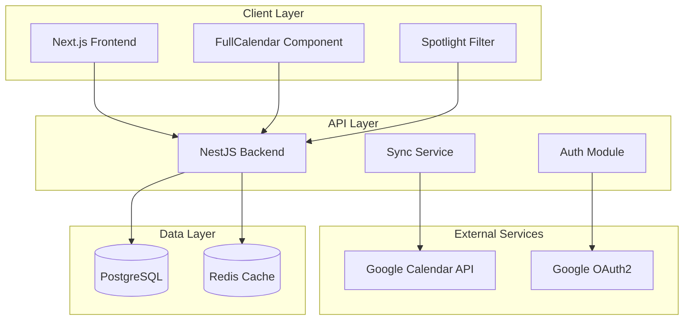

# Design Document

## Overview

The Class Schedule Sync system is a web application that provides students with an intuitive interface to manage their academic schedules while maintaining seamless integration with Google Calendar. The architecture follows a modern full-stack approach with Next.js frontend, NestJS backend, PostgreSQL database, and Google Calendar API integration.

The system emphasizes user experience through features like Spotlight filtering, batch import capabilities, and real-time synchronization while maintaining data security and privacy standards.

## Architecture

### High-Level Architecture



### Technology Stack

**Frontend:**
- Next.js 14 with App Router for server-side rendering and routing
- React 18 for component architecture
- Tailwind CSS for styling and responsive design
- TanStack Query for server state management and caching
- FullCalendar for calendar visualization
- React Hook Form for form management
- Zustand for client-side state management

**Backend:**
- NestJS for modular backend architecture
- TypeScript for type safety
- Passport.js for authentication strategies
- Bull Queue for background job processing
- Class Validator for input validation
- TypeORM for database operations

**Database:**
- PostgreSQL for primary data storage
- Redis for session storage and job queues

**External APIs:**
- Google OAuth2 for authentication
- Google Calendar API v3 for calendar synchronization

## Components and Interfaces

### Frontend Components

#### Calendar Dashboard
```typescript
interface CalendarDashboardProps {
  events: LocalEvent[]
  viewMode: 'month' | 'week' | 'agenda'
  spotlightFilter: SpotlightQuery
  onEventClick: (event: LocalEvent) => void
  onViewChange: (view: string) => void
}
```

#### Spotlight Filter
```typescript
interface SpotlightFilterProps {
  subjects: Subject[]
  sections: Section[]
  onFilterChange: (filter: SpotlightQuery) => void
  savedFilters: SavedFilter[]
}

interface SpotlightQuery {
  subjectIds?: string[]
  secCodes?: string[]
  text?: string
  dateRange?: { from: string; to: string }
  viewMode?: 'hide_others' | 'dim_others'
}
```

#### Import Wizard
```typescript
interface ImportWizardProps {
  onFileUpload: (file: File) => Promise<ImportJob>
  onColumnMapping: (jobId: string, mapping: ColumnMapping) => void
  onApplyImport: (jobId: string) => Promise<ImportResult>
}

interface ColumnMapping {
  [csvColumn: string]: string // maps to database field
}
```

### Backend Services

#### Authentication Service
```typescript
@Injectable()
export class AuthService {
  async googleLogin(code: string): Promise<AuthResult>
  async refreshToken(userId: string): Promise<TokenResult>
  async logout(userId: string): Promise<void>
  async validateUser(token: string): Promise<User>
}
```

#### Calendar Sync Service
```typescript
@Injectable()
export class CalendarSyncService {
  async syncToGoogle(userId: string, options: SyncOptions): Promise<SyncResult>
  async createGoogleEvent(event: LocalEvent): Promise<GoogleEvent>
  async updateGoogleEvent(event: LocalEvent): Promise<GoogleEvent>
  async deleteGoogleEvent(eventId: string): Promise<void>
  async handleConflicts(conflicts: EventConflict[]): Promise<ConflictResolution[]>
}
```

#### Import Service
```typescript
@Injectable()
export class ImportService {
  async parseFile(file: Buffer, type: 'csv' | 'xlsx'): Promise<ImportPreview>
  async createImportJob(userId: string, data: ImportData): Promise<ImportJob>
  async applyImport(jobId: string): Promise<ImportResult>
  async validateImportData(data: ImportRow[]): Promise<ValidationResult>
}
```

## Data Models

### Database Schema & Constraints

#### Complete PostgreSQL Schema
```sql
-- users
CREATE TABLE "user" (
  id UUID PRIMARY KEY DEFAULT gen_random_uuid(),
  email TEXT NOT NULL UNIQUE,
  display_name TEXT NOT NULL,
  created_at TIMESTAMPTZ NOT NULL DEFAULT now(),
  last_login_at TIMESTAMPTZ
);

-- calendar_account
CREATE TABLE calendar_account (
  id UUID PRIMARY KEY DEFAULT gen_random_uuid(),
  user_id UUID NOT NULL REFERENCES "user"(id) ON DELETE CASCADE,
  provider TEXT NOT NULL CHECK (provider='google'),
  google_sub TEXT NOT NULL,
  access_token_enc TEXT NOT NULL,
  refresh_token_enc TEXT NOT NULL,
  token_expires_at TIMESTAMPTZ NOT NULL,
  primary_calendar_id TEXT,
  created_at TIMESTAMPTZ NOT NULL DEFAULT now(),
  updated_at TIMESTAMPTZ NOT NULL DEFAULT now(),
  UNIQUE (provider, google_sub)
);

-- subject
CREATE TABLE subject (
  id UUID PRIMARY KEY DEFAULT gen_random_uuid(),
  user_id UUID NOT NULL REFERENCES "user"(id) ON DELETE CASCADE,
  code TEXT,
  name TEXT NOT NULL,
  color_hex TEXT NOT NULL,
  meta JSONB,
  created_at TIMESTAMPTZ NOT NULL DEFAULT now(),
  UNIQUE (user_id, code, name)
);

-- section
CREATE TABLE section (
  id UUID PRIMARY KEY DEFAULT gen_random_uuid(),
  subject_id UUID NOT NULL REFERENCES subject(id) ON DELETE CASCADE,
  sec_code TEXT NOT NULL,
  teacher TEXT,
  room TEXT,
  schedule_rules JSONB NOT NULL,
  UNIQUE (subject_id, sec_code)
);

-- local_event
CREATE TABLE local_event (
  id UUID PRIMARY KEY DEFAULT gen_random_uuid(),
  user_id UUID NOT NULL REFERENCES "user"(id) ON DELETE CASCADE,
  subject_id UUID NOT NULL REFERENCES subject(id) ON DELETE CASCADE,
  section_id UUID NOT NULL REFERENCES section(id) ON DELETE CASCADE,
  event_date DATE NOT NULL,
  start_time TIME NOT NULL,
  end_time TIME NOT NULL,
  room TEXT,
  title_override TEXT,
  status TEXT NOT NULL DEFAULT 'planned' CHECK (status IN ('planned','synced','deleted')),
  gcal_event_id TEXT,
  gcal_etag TEXT,
  created_at TIMESTAMPTZ NOT NULL DEFAULT now(),
  updated_at TIMESTAMPTZ NOT NULL DEFAULT now(),
  UNIQUE (user_id, subject_id, section_id, event_date, start_time, end_time)
);

-- saved_filter
CREATE TABLE saved_filter (
  id UUID PRIMARY KEY DEFAULT gen_random_uuid(),
  user_id UUID NOT NULL REFERENCES "user"(id) ON DELETE CASCADE,
  name TEXT NOT NULL,
  query JSONB NOT NULL,
  UNIQUE (user_id, name)
);

-- import_job
CREATE TABLE import_job (
  id UUID PRIMARY KEY DEFAULT gen_random_uuid(),
  user_id UUID NOT NULL REFERENCES "user"(id) ON DELETE CASCADE,
  source_type TEXT NOT NULL CHECK (source_type IN ('csv','xlsx')),
  column_map JSONB,
  state TEXT NOT NULL CHECK (state IN ('pending','preview','applied','failed')),
  error_message TEXT,
  created_at TIMESTAMPTZ NOT NULL DEFAULT now()
);

-- import_item
CREATE TABLE import_item (
  id UUID PRIMARY KEY DEFAULT gen_random_uuid(),
  import_job_id UUID NOT NULL REFERENCES import_job(id) ON DELETE CASCADE,
  raw_row JSONB NOT NULL,
  subject_id UUID,
  section_id UUID,
  start_date DATE,
  end_date DATE,
  days_of_week TEXT,
  start_time TIME,
  end_time TIME,
  room TEXT,
  note TEXT,
  status TEXT NOT NULL DEFAULT 'preview' CHECK (status IN ('preview','created','skipped','failed'))
);

-- Performance indexes
CREATE INDEX idx_event_user_date ON local_event (user_id, event_date);
CREATE INDEX idx_subject_user_name ON subject (user_id, name);
CREATE INDEX idx_section_subject_seccode ON section (subject_id, sec_code);
CREATE INDEX idx_calendar_account_user ON calendar_account (user_id);
CREATE INDEX idx_import_job_user_state ON import_job (user_id, state);

-- Full-text search for Spotlight
CREATE INDEX idx_subject_search ON subject USING GIN (to_tsvector('english', name || ' ' || COALESCE(code, '')));
```
```

#### Subject Entity
```typescript
@Entity()
export class Subject {
  @PrimaryGeneratedColumn('uuid')
  id: string

  @Column()
  userId: string

  @Column()
  code: string // e.g., "960200"

  @Column()
  name: string // e.g., "SPM"

  @Column()
  colorHex: string

  @Column('jsonb', { nullable: true })
  meta: Record<string, any> // teacher, faculty, etc.

  @OneToMany(() => Section, section => section.subject)
  sections: Section[]

  @OneToMany(() => LocalEvent, event => event.subject)
  events: LocalEvent[]
}
```

#### LocalEvent Entity
```typescript
@Entity()
export class LocalEvent {
  @PrimaryGeneratedColumn('uuid')
  id: string

  @Column()
  userId: string

  @Column()
  subjectId: string

  @Column()
  sectionId: string

  @Column('date')
  eventDate: Date

  @Column('time')
  startTime: string

  @Column('time')
  endTime: string

  @Column()
  room: string

  @Column({ nullable: true })
  titleOverride: string

  @Column({ default: 'planned' })
  status: 'planned' | 'synced' | 'deleted'

  @Column({ nullable: true })
  gcalEventId: string

  @Column({ nullable: true })
  gcalEtag: string

  @ManyToOne(() => Subject)
  subject: Subject

  @ManyToOne(() => Section)
  section: Section
}
```

### API Interfaces

#### Sync Request/Response
```typescript
interface SyncRequest {
  direction: 'upsert-to-google'
  range: {
    from: string
    to: string
  }
  eventIds?: string[] // optional: sync specific events
}

interface SyncResult {
  summary: {
    created: number
    updated: number
    skipped: number
    failed: number
  }
  details: SyncDetail[]
  conflicts: EventConflict[]
}
```

#### Google Calendar Event Format
```typescript
interface GoogleCalendarEvent {
  summary: string // "{SUBJECT_CODE} {SUBJECT_NAME} ({SEC})"
  location: string // room
  description: string // teacher, notes
  start: { dateTime: string }
  end: { dateTime: string }
  recurrence?: string[] // RRULE for recurring events
  colorId: string // mapped from subject color
  reminders: {
    useDefault: boolean
    overrides?: Array<{ method: string; minutes: number }>
  }
}
```

## Error Handling

### Client-Side Error Handling
- Global error boundary for React components
- Toast notifications for user-facing errors
- Retry mechanisms for failed API calls
- Offline state detection and queuing

### Server-Side Error Handling
```typescript
@Catch()
export class GlobalExceptionFilter implements ExceptionFilter {
  catch(exception: unknown, host: ArgumentsHost) {
    // Log errors with context
    // Return appropriate HTTP status codes
    // Sanitize error messages for client
  }
}
```

### Google API Error Handling
- Rate limiting with exponential backoff
- Token refresh on 401 errors
- Conflict resolution for 412 (precondition failed)
- Batch operation error isolation

### RRULE & Exception Handling Strategy

#### Recurring Event Management
```typescript
interface RecurrenceStrategy {
  // Weekly class → Single Google Event + RRULE
  createWeeklyClass(section: Section): GoogleCalendarEvent
  
  // Skip specific dates → Add EXDATE to existing event
  addSkipDates(eventId: string, dates: Date[]): void
  
  // Room/time change for specific instance → Exception override
  createExceptionEvent(baseEventId: string, date: Date, overrides: EventOverride): GoogleCalendarEvent
}

// Decision criteria:
// - Skip list ≤ 6 times/semester → Use EXDATE
// - Frequent time changes → Separate single events for changes
```

#### Conflict Resolution State Machine
```typescript
enum ConflictResolution {
  AUTO_MERGE = 'auto_merge',      // Non-critical fields (description, location)
  USER_RESOLVE = 'user_resolve',  // Time/date conflicts
  RECREATE = 'recreate',          // Deleted on Google but exists locally
  UNLINK = 'unlink'               // Remove Google association
}

interface ConflictHandler {
  handleEtagMismatch(localEvent: LocalEvent, googleEvent: GoogleEvent): ConflictResolution
  mergeNonCriticalFields(local: LocalEvent, google: GoogleEvent): LocalEvent
  presentUserChoice(conflicts: EventConflict[]): Promise<UserResolution[]>
}
```

### Idempotency & Job Processing

#### Request Deduplication
```typescript
@Injectable()
export class IdempotencyService {
  async ensureIdempotent<T>(
    key: string, 
    operation: () => Promise<T>, 
    ttl: number = 86400
  ): Promise<T> {
    const cacheKey = `idem:${key}`
    const existing = await this.redis.get(cacheKey)
    if (existing) return JSON.parse(existing)
    
    const result = await operation()
    await this.redis.setex(cacheKey, ttl, JSON.stringify(result))
    return result
  }
}
```

#### Batch Processing Policy
```typescript
interface BatchPolicy {
  chunkSize: 50              // events per request
  concurrency: 2             // parallel requests
  retryAttempts: 3           // with backoff: 1s, 2s, 4s
  dailyQuotaLimit: 3000      // writes per user per day
  circuitBreakerThreshold: 5 // consecutive 403/429 errors
}
```

### Google Color Mapping

#### Deterministic Color Assignment
```typescript
const GOOGLE_PALETTE = [
  {id:'1', hex:'#a4bdfc'}, {id:'2', hex:'#7ae7bf'}, {id:'3', hex:'#dbadff'},
  {id:'4', hex:'#ff887c'}, {id:'5', hex:'#fbd75b'}, {id:'6', hex:'#ffb878'},
  {id:'7', hex:'#46d6db'}, {id:'8', hex:'#e1e1e1'}, {id:'9', hex:'#5484ed'},
  {id:'10',hex:'#51b749'}, {id:'11',hex:'#dc2127'}
];

function mapToGoogleColor(subjectColorHex: string): string {
  // Calculate RGB distance and return closest Google palette ID
  const rgb = hexToRgb(subjectColorHex)
  let minDistance = Infinity
  let closestId = '1'
  
  for (const color of GOOGLE_PALETTE) {
    const distance = calculateRgbDistance(rgb, hexToRgb(color.hex))
    if (distance < minDistance) {
      minDistance = distance
      closestId = color.id
    }
  }
  return closestId
}
```

### Enhanced API Contracts

#### Standardized Error Format
```typescript
interface ApiError {
  error: {
    code: 'CONFLICT_ETAG' | 'VALIDATION_FAILED' | 'QUOTA_EXCEEDED' | 'UNAUTHORIZED'
    message: string
    details?: Record<string, any>
  }
}
```

#### Sync Endpoint with Dry Run
```typescript
interface SyncRequest {
  direction: 'upsert-to-google'
  range: { from: string; to: string }
  eventIds?: string[]
  dryRun?: boolean           // Preview changes without applying
  idempotencyKey: string     // Required for deduplication
}

interface SyncResponse {
  summary: {
    created: number
    updated: number
    skipped: number
    failed: number
  }
  details: SyncDetail[]
  conflicts: EventConflict[]
  quotaUsed: number
  isDryRun: boolean
}
```

### Input Validation Rules

#### Import/Quick Add Validation
```typescript
interface ValidationRules {
  time: {
    format: 'HH:mm'           // 24-hour format
    constraint: 'start < end'
  }
  days: {
    accepted: ['MO','TU','WE','TH','FR','SA','SU'] | [1,2,3,4,5,6,7]
    normalize: 'to MO..SU format'
  }
  dates: {
    format: 'YYYY-MM-DD'
    constraint: 'start_date <= end_date'
    timezone: 'normalize to Asia/Bangkok'
  }
  text: {
    room: { maxLength: 64, trim: true }
    teacher: { maxLength: 128, trim: true }
    sectionCode: { normalize: '"Sec.001" → "001"' }
  }
}
```

### Common Error Scenarios
1. **Token Expiration**: Automatic refresh with fallback to re-authentication
2. **Rate Limiting**: Queue operations with backoff strategy and circuit breaker
3. **Sync Conflicts**: ETag-based conflict detection with user resolution UI
4. **Import Validation**: Row-by-row validation with detailed error reporting
5. **Network Failures**: Retry with exponential backoff and idempotency protection
6. **Quota Exhaustion**: Daily limits with graceful degradation and user notification

## Testing Strategy

### Unit Testing
- Jest for backend service testing
- React Testing Library for component testing
- Mock Google API responses
- Database integration tests with test containers

### Integration Testing
- End-to-end API testing with Supertest
- Google OAuth flow testing with mock providers
- Calendar sync testing with Google API sandbox

### End-to-End Testing
- Playwright for full user journey testing
- Critical path testing: login → import → sync
- Cross-browser compatibility testing

### Performance Testing
- Load testing for import operations
- Google API rate limit testing
- Database query optimization validation

## Security Considerations

### Enhanced Security Implementation

#### Cryptography & Token Management
```typescript
interface CryptoService {
  // AES-256-GCM with random IV and AAD
  encryptToken(token: string, userId: string): EncryptedToken
  decryptToken(encrypted: EncryptedToken, userId: string): string
  rotateEncryptionKey(keyVersion: number): void
}

interface EncryptedToken {
  data: string        // encrypted token
  iv: string          // 12-byte initialization vector
  tag: string         // authentication tag
  keyVersion: number  // for key rotation
}

// JWT Configuration
const JWT_CONFIG = {
  accessTokenTTL: '15m',
  refreshTokenTTL: '7d',
  enableRefreshRotation: true,
  detectReuseAttacks: true
}
```

#### OAuth2 Security
```typescript
interface OAuthConfig {
  usesPKCE: true
  stateParameter: true
  scopes: ['openid', 'email', 'profile', 'https://www.googleapis.com/auth/calendar.events']
  enforceHTTPS: true
  validateRedirectURI: true
}
```

#### API Security Headers
```typescript
const SECURITY_HEADERS = {
  'Content-Security-Policy': "default-src 'self'; script-src 'self' 'unsafe-inline'",
  'X-Frame-Options': 'DENY',
  'X-Content-Type-Options': 'nosniff',
  'Referrer-Policy': 'strict-origin-when-cross-origin',
  'Permissions-Policy': 'camera=(), microphone=(), geolocation=()'
}
```

### Authentication & Authorization
- Google OAuth2 with PKCE and state parameter validation
- JWT access tokens (15min TTL) with refresh token rotation
- Refresh token reuse detection for security
- Session management with Redis and secure cookies

### Data Protection
- AES-256-GCM encryption for tokens with user-specific AAD
- Key versioning for encryption key rotation
- HTTPS enforcement with HSTS headers
- Input validation with class-validator and sanitization
- Parameterized queries with TypeORM for SQL injection prevention

### API Security
- Rate limiting: 100 req/min per user, 1000 req/hour per IP
- CORS restricted to production domains
- Request size limits: 10MB for file uploads, 1MB for JSON
- Idempotency keys required for state-changing operations
- API versioning with deprecation notices

### Privacy Compliance
- Minimal data collection (only calendar events and user profile)
- Explicit consent for calendar.events scope
- Data retention: 2 years inactive account cleanup
- GDPR compliance with data export and deletion endpoints
- Audit logging for sensitive operations

## Performance Optimization

### Frontend Optimization
- Code splitting by route
- Lazy loading of calendar components
- Virtual scrolling for large event lists
- Optimistic updates for better UX

### Backend Optimization
- Database indexing strategy
- Connection pooling
- Caching frequently accessed data
- Background job processing for heavy operations

### Google API Optimization
- Batch operations where possible
- RRULE usage for recurring events
- ETags for conditional requests
- Intelligent sync scheduling

## Production-Ready Implementation

### Folder Structure
```
apps/
  web/                    # Next.js frontend
    app/
      (auth)/
      dashboard/
      import/
      settings/
    components/
      calendar/
      spotlight/
      import/
    lib/
      api.ts
      auth.ts
    hooks/
    store/
  api/                    # NestJS backend
    src/
      modules/
        auth/
        subjects/
        sections/
        events/
        import/
        sync/
      common/
        filters/          # GlobalExceptionFilter
        pipes/            # ValidationPipe
        guards/           # AuthGuard
        interceptors/     # LoggingInterceptor
      infra/
        database/         # TypeORM configuration
        bull/             # Queue configuration
        crypto/           # Encryption service
        google/           # Google API client
    test/
      unit/
      integration/
      e2e/
packages/
  types/                  # Shared TypeScript interfaces
  ui/                     # Shared UI components (optional)
infra/
  docker-compose.yml      # Local development
  k8s/                    # Kubernetes manifests (future)
```

## Deployment Architecture

### Infrastructure Stack
- **Frontend**: Vercel for Next.js with edge functions
- **Backend**: Railway/Render for NestJS API with auto-scaling
- **Database**: Supabase PostgreSQL with connection pooling
- **Cache**: Redis Cloud with persistence
- **File Storage**: Vercel Blob for temporary import files
- **CDN**: Vercel Edge Network for static assets

### Environment Configuration
```typescript
interface EnvironmentConfig {
  // Database
  DATABASE_URL: string
  REDIS_URL: string
  
  // Authentication
  GOOGLE_CLIENT_ID: string
  GOOGLE_CLIENT_SECRET: string
  JWT_SECRET: string
  ENCRYPTION_KEY: string          // 32 bytes for AES-256
  
  // Application
  FRONTEND_URL: string
  API_BASE_URL: string
  
  // Monitoring
  SENTRY_DSN?: string
  LOG_LEVEL: 'debug' | 'info' | 'warn' | 'error'
  
  // Rate Limiting
  RATE_LIMIT_WINDOW: number       // seconds
  RATE_LIMIT_MAX: number          // requests per window
  
  // Google API
  GOOGLE_API_QUOTA_LIMIT: number  // daily limit per user
}
```

### Monitoring & Observability

#### Structured Logging
```typescript
interface LogContext {
  userId?: string
  route: string
  method: string
  latency: number
  gapiQuotaCost: number
  retryCount: number
  idempotencyKey?: string
}
```

#### Key Metrics
```typescript
interface ApplicationMetrics {
  // Sync Operations
  sync_jobs_inflight: Gauge
  sync_events_created: Counter
  sync_events_updated: Counter
  sync_events_failed: Counter
  
  // Google API
  gapi_quota_remaining: Gauge
  gapi_requests_total: Counter
  gapi_errors_total: Counter
  
  // Database
  db_query_duration: Histogram
  db_connections_active: Gauge
  
  // Queue
  queue_jobs_waiting: Gauge
  queue_jobs_processing: Gauge
  queue_lag_seconds: Gauge
}
```

#### Alerting Rules
- High Google API Error Rate (>10/min)
- Queue Lag High (>30s)
- Database Slow Queries (>200ms)
- Quota Exhaustion (<100 remaining)

### Definition of Done (MVP)

#### End-to-End Test Scenarios (Playwright)
1. **Authentication Flow**: Login → Dashboard → Google Calendar connection
2. **Quick Add**: Create class → Display in calendar → Sync to Google (RRULE)
3. **Import Flow**: Upload CSV (10 rows, 2 errors) → Preview → Fix mapping → Apply → Sync → Summary
4. **Spotlight Filter**: Filter by subject+section AND text search → Toggle dim/hide modes
5. **Conflict Resolution**: Modify class time → Update Google with ETag → Handle 412 conflict

#### Performance Benchmarks
- Dashboard initial load: < 1s (100 events within current month)
- Import preview: < 3s (500 rows CSV)
- Sync operation: < 5s (50 events batch)
- Spotlight filter: < 200ms (1000+ events)

#### Security Checklist
- [ ] No high/critical vulnerabilities (npm audit)
- [ ] All security headers implemented
- [ ] CSRF protection on state-changing operations
- [ ] Input validation on all endpoints
- [ ] Rate limiting configured
- [ ] Encryption keys properly managed
- [ ] OAuth2 PKCE implemented
- [ ] Token rotation working

#### Reliability Requirements
- [ ] Idempotency protection on all sync operations
- [ ] Circuit breaker for Google API failures
- [ ] Graceful degradation when quota exceeded
- [ ] Database constraints prevent data corruption
- [ ] Background job retry logic working
- [ ] Conflict resolution UI functional